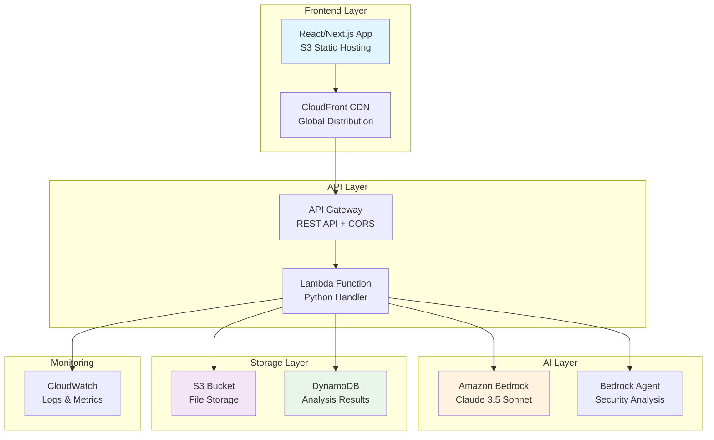

# ArchLens - AWS Architecture Analysis SaaS

🏗️ **A production-ready SaaS application for analyzing AWS architecture diagrams using AI-powered insights from Amazon Bedrock.**

[](https://aws.amazon.com/) [](https://aws.amazon.com/bedrock/) [](https://nextjs.org/) [](https://aws.amazon.com/cdk/)

## 🌟 Features

- 📁 **File Upload**: Support for draw.io XML files with real-time validation
- 🤖 **AI-Powered Analysis**: AWS Well-Architected Framework security analysis via Amazon Bedrock Claude 3.5 Sonnet
- ⚡ **Real-time Progress**: Polling-based progress tracking with intelligent error handling
- 📊 **Results Dashboard**: Interactive scoring, security issues, and recommendations
- 🎨 **Modern UI**: React/Next.js with shadcn/ui components and dark mode
- 🚀 **Serverless Backend**: Lightweight Python handlers on AWS Lambda
- 🏗️ **Infrastructure as Code**: Complete AWS CDK deployment with resource tagging
- 💰 **Cost Optimized**: Pay-per-use serverless architecture with intelligent retry logic

## 🏛️ Architecture



### 🔧 Technical Stack

| Layer | Technology | Purpose |
|-------|------------|---------|
| **Frontend** | Next.js 14, TypeScript, Tailwind CSS | Static site with modern UI components |
| **API** | AWS Lambda, Python 3.11 | Serverless request handling |
| **AI** | Amazon Bedrock (Claude 3.5 Sonnet) | Architecture analysis and security recommendations |
| **Storage** | S3 (files), DynamoDB (results) | Scalable data persistence |
| **Infrastructure** | AWS CDK (Python) | Infrastructure as Code |
| **Monitoring** | CloudWatch | Logging and observability |

## 📂 Project Structure

```
ArchLens/
├── 🎨 frontend/                    # Next.js Application
│   ├── app/                       # App Router pages
│   ├── components/                # Reusable UI components
│   ├── lib/                       # API client and utilities
│   └── types/                     # TypeScript definitions
├── ⚡ backend_clean/               # Lightweight Lambda Handlers
│   ├── lightweight_handler.py     # Main API handler with Bedrock integration
│   └── lightweight_processor.py   # Background processing handler
├── 🏗️ infrastructure/             # AWS CDK Infrastructure
│   ├── app.py                     # CDK application entry point
│   ├── stacks/                    # Individual CloudFormation stacks
│   │   ├── storage_stack.py       # S3 + DynamoDB resources
│   │   ├── ai_stack.py            # Bedrock agent configuration
│   │   ├── compute_stack.py       # Lambda + API Gateway
│   │   └── frontend_stack.py      # CloudFront + S3 hosting
│   └── config/                    # Resource tagging and configuration
├── 📚 examples/                   # Sample architecture files
├── 📖 docs/                       # Additional documentation
└── 🛠️ scripts/                    # Deployment and utility scripts
```

## 🚀 Quick Start

### Prerequisites

- **Node.js** 18+ and npm
- **Python** 3.11+
- **AWS CLI** configured with appropriate permissions
- **AWS CDK** CLI installed (`npm install -g aws-cdk`)

### 1. Clone and Setup

```bash
git clone <repository-url>
cd ArchLens

# Install infrastructure dependencies
cd infrastructure
python -m venv venv
source venv/bin/activate  # On Windows: venv\Scripts\activate
pip install -r requirements.txt

# Install frontend dependencies  
cd ../frontend
npm install
```

### 2. Deploy Infrastructure

```bash
cd infrastructure
source venv/bin/activate

# Bootstrap CDK (one-time setup)
cdk bootstrap

# Deploy all stacks
cdk deploy --all --require-approval never
```

**Deployment Order:**
1. `ArchLens-Storage` - S3 buckets and DynamoDB tables
2. `ArchLens-AI` - Bedrock agent and knowledge base
3. `ArchLens-Compute` - Lambda functions and API Gateway
4. `ArchLens-Frontend` - CloudFront distribution and S3 hosting

### 3. Build and Deploy Frontend

```bash
cd frontend

# Update API endpoint in lib/api.ts (if needed)
# The CDK output will show your API Gateway URL

npm run build
aws s3 sync out/ s3://your-frontend-bucket-name --delete
```

### 4. Access Your Application

Your application will be available at the CloudFront URL provided in the CDK output.

## 🔧 Configuration

### Environment Variables

The Lambda functions use these environment variables (automatically set by CDK):

```python
UPLOAD_BUCKET=archlens-uploads-{account}-{region}
ANALYSIS_TABLE=ArchLens-Analysis-{region}
BEDROCK_AGENT_ID=BQ2AJX1QNF  # Auto-generated
BEDROCK_AGENT_ALIAS_ID=TSTALIASID
AWS_REGION=ap-southeast-2
```

### Bedrock Quotas

⚠️ **Important**: New AWS accounts have very low Bedrock quotas:

- **Claude 3.5 Sonnet**: 1 request/minute (default)
- **Recommended**: 50-100 requests/minute for production

**To increase quotas:**
1. Go to AWS Console → Service Quotas
2. Search for "Bedrock"
3. Find "On-demand model inference requests per minute for Anthropic Claude 3.5 Sonnet"
4. Request increase with business justification

## 💰 Cost Analysis

### Per-Request Pricing (Australia ap-southeast-2)

| Component | Cost | Details |
|-----------|------|---------|
| **Bedrock Analysis** | $0.008 | ~250 input + 500 output tokens |
| **Lambda Execution** | $0.0001 | ~200ms execution |
| **API Gateway** | $0.0000035 | Per request |
| **DynamoDB** | $0.000001 | On-demand writes |
| **S3 Storage** | $0.0000004 | Per file |
| **Total per analysis** | **~$0.008** | **Less than 1 cent!** |

### Monthly Cost Scenarios

| Usage Level | Requests/Month | Monthly Cost | Use Case |
|-------------|----------------|--------------|----------|
| **Development** | 1,000 | $8 | Testing and development |
| **Small Business** | 7,200 (10/hour) | $59 | Small team usage |
| **Production** | 36,000 (50/hour) | $297 | Active SaaS business |
| **Enterprise** | 144,000 (200/hour) | $1,188 | High-volume usage |

**💡 Key Insight**: The quota increase is FREE - you only pay for actual usage!

## 🔌 API Reference

### Endpoints

| Method | Endpoint | Description |
|--------|----------|-------------|
| `POST` | `/api/analyze` | Upload and analyze draw.io file |
| `GET` | `/api/analysis/{id}` | Get complete analysis results |
| `GET` | `/api/analysis/{id}/status` | Check analysis progress |
| `GET` | `/api/health` | Health check and configuration |

### Request/Response Examples

**Upload File:**
```bash
curl -X POST https://your-api-url/api/analyze \
  -H "Content-Type: multipart/form-data" \
  -F "file=@architecture.drawio"
```

**Response:**
```json
{
  "analysis_id": "analysis_abc123",
  "status": "completed",
  "message": "File uploaded and analyzed successfully",
  "description": "Architecture contains 4 components: ALB, EC2, RDS, S3",
  "timestamp": "2025-07-02T12:00:00Z"
}
```

**Get Results:**
```bash
curl https://your-api-url/api/analysis/analysis_abc123
```

## 🛠️ Error Handling & Troubleshooting

### Common Error Scenarios

#### 1. Bedrock Quota Limits
**Error**: `⚠️ Bedrock Quota Limit: Your account has a 1 request/minute quota`

**Solution**: 
- Request quota increase in AWS Console → Service Quotas
- Wait 60+ seconds between requests for testing

#### 2. Permission Issues  
**Error**: `🔒 Permission Error: Insufficient Bedrock permissions`

**Solution**:
- Ensure Lambda execution role has `bedrock:InvokeAgent` permission
- Verify Bedrock agent is in the same region

#### 3. File Upload Issues
**Error**: `Invalid File Type` or `File Parse Error`

**Solution**:
- Ensure file is a valid draw.io (.drawio) or XML file
- Check file contains valid XML content
- File size should be under 10MB

### Monitoring and Debugging

**CloudWatch Logs:**
```bash
# View Lambda logs
aws logs tail /aws/lambda/ArchLens-Compute-APILambda --follow

# Search for specific errors
aws logs filter-log-events \
  --log-group-name "/aws/lambda/ArchLens-Compute-APILambda" \
  --filter-pattern "ERROR"
```

**Health Check:**
```bash
curl https://your-api-url/api/health
```

## 🔒 Security

### Infrastructure Security
- ✅ **IAM Roles**: Least privilege access with specific resource ARNs
- ✅ **API Gateway**: Built-in throttling and CORS configuration
- ✅ **S3 Security**: Bucket policies and server-side encryption
- ✅ **VPC**: Lambda functions in default VPC with security groups
- ✅ **Monitoring**: CloudWatch logging for all components

### Data Security
- 🔒 **Encryption**: Data encrypted at rest (S3, DynamoDB) and in transit (HTTPS)
- 🗑️ **TTL**: Analysis results auto-expire after 7 days
- 🔐 **No PII**: System processes architecture diagrams only
- 🛡️ **Input Validation**: File type and size validation

## 🚀 Deployment Strategies

### Development
```bash
# Quick deployment for testing
cd infrastructure
cdk deploy ArchLens-Compute --require-approval never
```

### Production
```bash
# Deploy with explicit approval
cd infrastructure
cdk deploy --all --require-approval always

# Deploy with specific configuration
cdk deploy --all \
  --parameters Environment=production \
  --parameters EnableLogging=true
```

### CI/CD Integration
```yaml
# Example GitHub Actions workflow
name: Deploy ArchLens
on:
  push:
    branches: [main]
jobs:
  deploy:
    runs-on: ubuntu-latest
    steps:
      - uses: actions/checkout@v3
      - name: Deploy Infrastructure
        run: |
          cd infrastructure
          npm install -g aws-cdk
          pip install -r requirements.txt
          cdk deploy --all --require-approval never
```

## 📊 Performance Optimization

### Lambda Optimization
- **Memory**: 1024MB for API, 2048MB for processor
- **Timeout**: 15 minutes for Bedrock analysis
- **Retry Logic**: Exponential backoff for throttling
- **Cold Start**: Lightweight handlers minimize startup time

### Frontend Optimization
- **Static Generation**: Next.js static export for fast loading
- **CDN**: CloudFront global distribution
- **Bundle Size**: Tree-shaking and code splitting
- **Images**: Optimized loading with next/image

## 🧪 Testing

### Local Testing
```bash
# Test backend locally
cd backend_clean
python -m pytest tests/

# Test frontend locally
cd frontend
npm run dev
npm run test
```

### Integration Testing
```bash
# Test deployed API
curl -X POST https://your-api-url/api/health

# Test file upload
curl -X POST https://your-api-url/api/analyze \
  -F "file=@examples/sample-aws-architecture.xml"
```

## 🤝 Contributing

1. **Fork** the repository
2. **Create** a feature branch: `git checkout -b feature/amazing-feature`
3. **Make** your changes and add tests
4. **Run** tests: `pytest backend/tests/` and `npm test` in frontend
5. **Commit** your changes: `git commit -m 'Add amazing feature'`
6. **Push** to your branch: `git push origin feature/amazing-feature`
7. **Submit** a pull request

### Development Guidelines
- ✅ Follow existing code style and patterns
- ✅ Add tests for new functionality
- ✅ Update documentation for API changes
- ✅ Use conventional commit messages
- ✅ Ensure security best practices

## 📝 License

MIT License - see [LICENSE](LICENSE) file for details.

## 🆘 Support

### Getting Help
- 📖 **Documentation**: Check the `/docs` folder for detailed guides
- 🐛 **Issues**: Create an issue on GitHub for bugs or feature requests
- 💬 **Discussions**: Use GitHub Discussions for questions

### Useful Resources
- [AWS Bedrock Documentation](https://docs.aws.amazon.com/bedrock/)
- [AWS CDK Python Guide](https://docs.aws.amazon.com/cdk/v2/guide/)
- [Next.js Documentation](https://nextjs.org/docs)
- [AWS Well-Architected Framework](https://aws.amazon.com/architecture/well-architected/)

---

**Built with ❤️ for the AWS community**