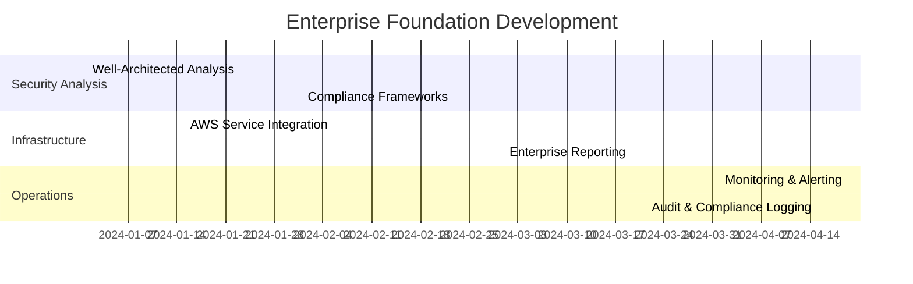
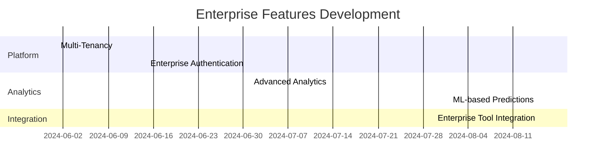
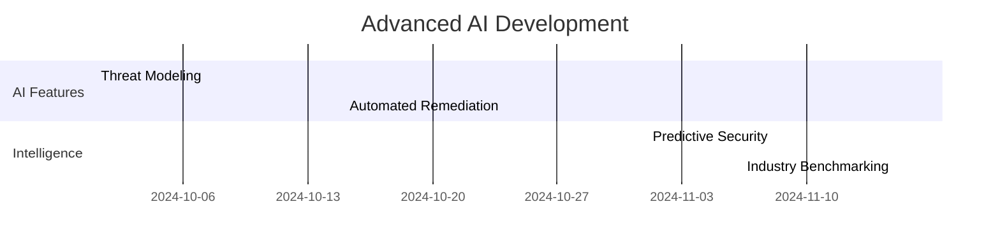

# ArchLens Enterprise Readiness Roadmap

## 🎯 Current State vs Enterprise Requirements

### What We Have (PoC Level)
✅ **Basic AI Analysis**: Simple Bedrock integration with Claude 3.5 Sonnet  
✅ **AWS Service Detection**: Pattern matching for common AWS services  
✅ **Simple Security Scoring**: 0-10 scale with basic recommendations  
✅ **Serverless Infrastructure**: Scalable AWS backend with CloudFormation  
✅ **Web Interface**: Modern React frontend with file upload  

### What's Missing for Enterprise Production

## 🚨 Critical Gaps (Phase 1 - Must Have)

### 1. **Advanced Security Analysis Engine**

**Current**: Basic pattern matching and generic security advice  
**Required**: Comprehensive Well-Architected Framework analysis

```python
# Need to implement sophisticated security analysis
class WellArchitectedSecurityAnalyzer:
    def analyze_data_protection(self, architecture):
        """Analyze encryption, data classification, backup strategies"""
        
    def assess_identity_access_management(self, architecture):
        """Evaluate IAM policies, least privilege, MFA requirements"""
        
    def evaluate_infrastructure_protection(self, architecture):
        """Network security, VPC design, security groups analysis"""
        
    def analyze_detective_controls(self, architecture):
        """Logging, monitoring, alerting, incident response readiness"""
        
    def assess_incident_response(self, architecture):
        """Incident response procedures, automation, recovery plans"""
```

**Implementation Priority**: 🔴 **CRITICAL**
- **Effort**: 3-4 months
- **Value**: Core enterprise differentiator

### 2. **Compliance Framework Integration**

**Current**: No compliance framework support  
**Required**: Multi-framework compliance analysis

```typescript
interface ComplianceFrameworks {
    SOC2: ComplianceAssessment;
    PCI_DSS: ComplianceAssessment;
    HIPAA: ComplianceAssessment;
    FedRAMP: ComplianceAssessment;
    ISO27001: ComplianceAssessment;
    NIST_CSF: ComplianceAssessment;
}

interface ComplianceAssessment {
    overallCompliance: number;
    controlsAssessed: ControlAssessment[];
    gaps: ComplianceGap[];
    evidence: Evidence[];
    recommendations: RemediationPlan[];
}
```

**Implementation Priority**: 🔴 **CRITICAL**
- **Effort**: 4-5 months
- **Value**: Regulatory requirement for enterprises

### 3. **Enterprise Reporting & Analytics**

**Current**: Simple JSON response  
**Required**: Executive dashboards and detailed reports

```typescript
interface EnterpriseReport {
    executiveSummary: {
        riskScore: number;
        criticalFindings: number;
        complianceStatus: ComplianceStatus;
        businessImpact: BusinessImpact;
        costOfRemediation: CostAnalysis;
    };
    
    technicalAnalysis: {
        detailedFindings: SecurityFinding[];
        architectureComplexity: ComplexityMetrics;
        securityMaturity: MaturityAssessment;
        controlEffectiveness: ControlAnalysis[];
    };
    
    actionablePlans: {
        immediatePriority: Action[];
        shortTerm: Action[];
        longTerm: Action[];
        estimatedEffort: EffortEstimate;
    };
}
```

**Implementation Priority**: 🟡 **HIGH**
- **Effort**: 2-3 months
- **Value**: C-level visibility and decision making

### 4. **AWS Service Integration**

**Current**: Basic S3 and DynamoDB usage  
**Required**: Full AWS security ecosystem integration

```python
class AWSSecurityEcosystem:
    def integrate_security_hub(self):
        """Centralized security findings management"""
        
    def query_aws_config(self):
        """Configuration compliance and drift detection"""
        
    def analyze_guardduty_findings(self):
        """Threat detection and malicious activity analysis"""
        
    def assess_inspector_vulnerabilities(self):
        """Infrastructure vulnerability assessment"""
        
    def evaluate_cloudtrail_logs(self):
        """Audit trail and activity analysis"""
        
    def analyze_organizations_structure(self):
        """Multi-account security governance"""
```

**Implementation Priority**: 🟡 **HIGH**
- **Effort**: 3-4 months
- **Value**: Comprehensive security posture view

## 🔄 Enhanced Features (Phase 2 - Should Have)

### 5. **Multi-Tenancy & Enterprise Auth**

**Current**: Single-tenant with no authentication  
**Required**: Enterprise-grade multi-tenancy

```typescript
interface TenantConfiguration {
    tenantId: string;
    customBranding: BrandingConfig;
    securityPolicies: SecurityPolicy[];
    complianceFrameworks: string[];
    integrations: IntegrationConfig[];
    userManagement: UserConfig;
}

interface AuthenticationSystem {
    ssoIntegration: SAMLConfig | OIDCConfig;
    roleBasedAccess: RBACConfig;
    auditLogging: AuditConfig;
    sessionManagement: SessionConfig;
}
```

**Implementation Priority**: 🟡 **HIGH**
- **Effort**: 3-4 months
- **Value**: Enterprise scalability and security

### 6. **Advanced Analytics & ML**

**Current**: Static analysis only  
**Required**: Predictive analytics and trend analysis

```python
class SecurityAnalytics:
    def predict_security_risks(self, historical_data, architecture):
        """ML-based risk prediction"""
        
    def analyze_security_trends(self, time_series_data):
        """Security posture trends over time"""
        
    def benchmark_against_industry(self, architecture, industry):
        """Industry comparison and benchmarking"""
        
    def optimize_cost_security_tradeoffs(self, architecture, budget):
        """Cost-effective security improvement recommendations"""
```

**Implementation Priority**: 🟠 **MEDIUM**
- **Effort**: 4-5 months
- **Value**: Competitive differentiation

### 7. **Integration Ecosystem**

**Current**: Standalone application  
**Required**: Enterprise tool ecosystem integration

```typescript
interface EnterpriseIntegrations {
    ticketingSystems: JIRAIntegration | ServiceNowIntegration;
    communicationPlatforms: SlackIntegration | TeamsIntegration;
    securityTools: SplunkIntegration | QRadarIntegration;
    governanceTools: CollaborationIntegration;
    cicdPipelines: JenkinsIntegration | GitHubActionsIntegration;
}
```

**Implementation Priority**: 🟠 **MEDIUM**
- **Effort**: 2-3 months
- **Value**: Workflow integration and automation

## 🚀 Advanced Capabilities (Phase 3 - Nice to Have)

### 8. **AI-Powered Threat Modeling**

```python
class ThreatModelingEngine:
    def perform_stride_analysis(self, architecture):
        """Systematic threat identification using STRIDE methodology"""
        
    def generate_attack_trees(self, architecture):
        """Visual attack path analysis"""
        
    def simulate_attack_scenarios(self, architecture):
        """Attack simulation and impact assessment"""
```

### 9. **Automated Remediation**

```python
class AutomatedRemediation:
    def generate_terraform_fixes(self, security_issues):
        """Auto-generate Terraform code for security fixes"""
        
    def create_cloudformation_updates(self, recommendations):
        """Generate CloudFormation updates for recommendations"""
        
    def suggest_policy_changes(self, iam_issues):
        """Recommend IAM policy improvements"""
```

## 📊 Implementation Roadmap

### **Phase 1: Enterprise Foundation (6-8 months)**


### **Phase 2: Enterprise Features (4-6 months)**


### **Phase 3: Advanced AI (3-4 months)**


## 💰 Investment Requirements

### **Development Team Structure**
- **Phase 1**: 6 senior developers, 2 security experts, 1 DevOps engineer
- **Phase 2**: 4 developers, 1 ML engineer, 1 UX designer
- **Phase 3**: 3 developers, 1 data scientist, 1 security architect

### **Cost Estimation**
- **Phase 1**: $1.2M - $1.6M (6-8 months)
- **Phase 2**: $800K - $1.0M (4-6 months)
- **Phase 3**: $500K - $700K (3-4 months)
- **Total**: $2.5M - $3.3M over 13-18 months

### **ROI Justification**
- **Enterprise Licensing**: $50K-$200K per customer per year
- **Break-even**: 15-25 enterprise customers
- **Market Size**: Multi-billion dollar cloud security market
- **Competitive Advantage**: First-to-market comprehensive AI-powered security analysis

## 🎯 Minimum Viable Enterprise Product (MVEP)

For immediate enterprise demo and early customer validation, focus on:

### **3-Month MVEP Sprint**
1. **Enhanced Security Analysis** (6 weeks)
   - Well-Architected Framework integration
   - 20+ specific security checks
   - Detailed remediation guidance

2. **Basic Compliance Reporting** (4 weeks)
   - SOC2 and basic compliance frameworks
   - PDF report generation
   - Executive summary dashboard

3. **AWS Service Integration** (2 weeks)
   - Security Hub findings export
   - CloudTrail analysis integration

### **MVEP Success Metrics**
- **Technical**: Analyze 50+ AWS services with 90% accuracy
- **Business**: 3+ pilot customers willing to pay for full version
- **Operational**: 99.5% uptime with <5 second response times

## 🚨 Critical Dependencies

### **External Dependencies**
- **Bedrock Quota Increases**: Must secure 1000+ requests/minute
- **AWS Partnership**: Advanced AWS service access and support
- **Compliance Expertise**: Security and compliance subject matter experts
- **Enterprise Sales**: B2B sales team for enterprise customer acquisition

### **Technical Risks**
- **AI Model Accuracy**: Ensuring 95%+ accuracy for enterprise trust
- **Scalability**: Handling 100+ concurrent analyses
- **Integration Complexity**: Enterprise tool ecosystem complexity
- **Regulatory Changes**: Keeping up with evolving compliance requirements

## 📈 Success Metrics

### **Technical KPIs**
- Analysis accuracy: >95%
- Response time: <10 seconds for basic analysis
- System uptime: >99.9%
- False positive rate: <5%

### **Business KPIs**
- Customer acquisition: 10+ enterprise customers in Year 1
- Revenue: $2M+ ARR by end of Year 1
- Customer satisfaction: >4.5/5 rating
- Market penetration: 5% of target enterprise market

---

## 🎯 Immediate Next Steps for PoC Enhancement

### **Quick Wins (2-4 weeks)**
1. **Enhanced Bedrock Prompts**: More detailed security analysis prompts
2. **Better Service Detection**: Expanded AWS service recognition
3. **Improved Error Handling**: Better quota management and retries
4. **Basic Reporting**: PDF export and better visualization

### **Demo-Ready Features (1-2 months)**
1. **Well-Architected Integration**: Basic Security Pillar assessment
2. **Compliance Dashboard**: SOC2/security framework alignment
3. **Executive Summary**: C-level friendly reporting
4. **Integration Mockups**: Show enterprise tool integration potential

This roadmap transforms ArchLens from a PoC into an enterprise-grade security analysis platform that can compete with established players like CloudHealth, Prisma Cloud, and AWS Well-Architected Tool.