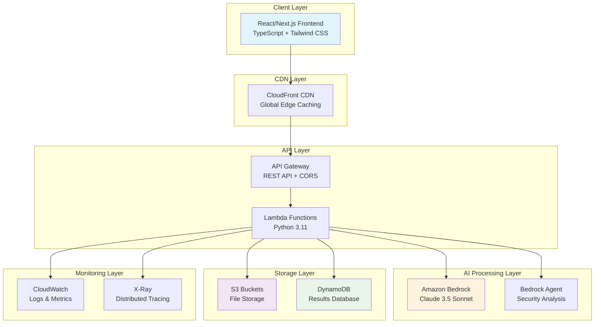
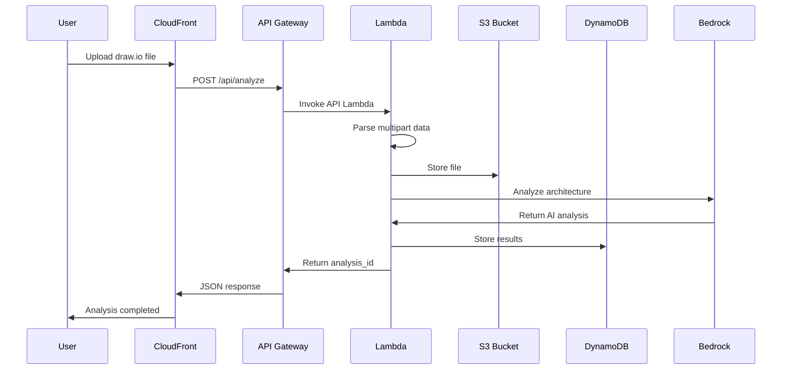
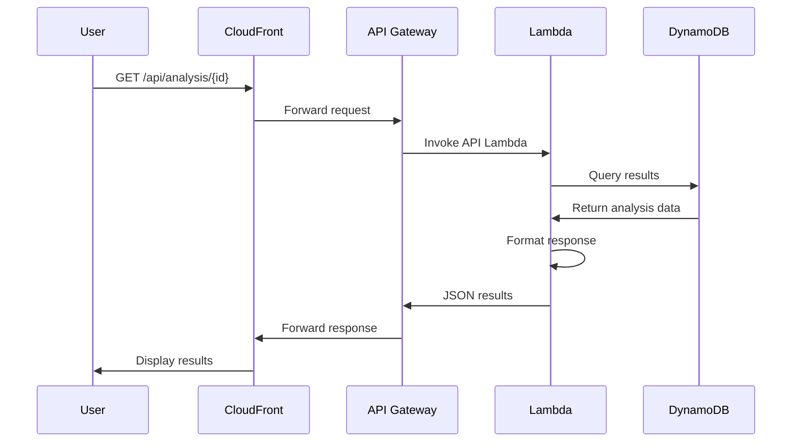
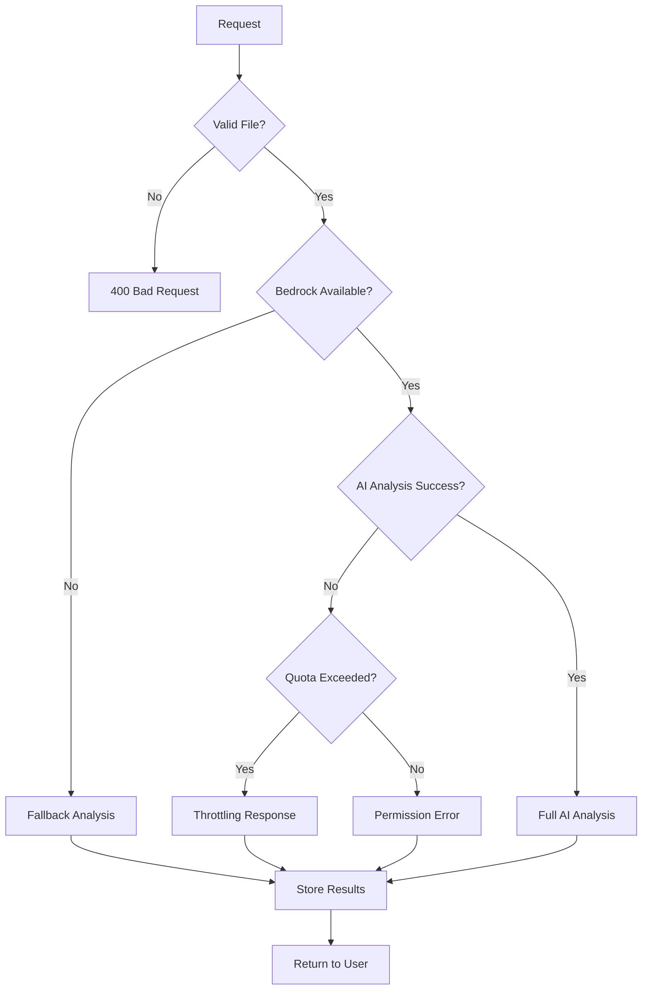

# ArchLens Technical Architecture Documentation

## 🏗️ System Overview

ArchLens is a production-ready serverless SaaS application built on AWS that provides AI-powered security analysis of AWS architecture diagrams. The system uses a modern, cloud-native architecture designed for scalability, security, and cost-effectiveness.

## 🎯 Architecture Principles

### Design Philosophy
- **Serverless-First**: Zero server management, automatic scaling
- **Event-Driven**: Asynchronous processing with intelligent retry logic
- **Security by Design**: Encryption at rest and in transit, least privilege access
- **Cost-Optimized**: Pay-per-use model with automatic resource cleanup
- **Observable**: Comprehensive logging and monitoring built-in

### Key Technical Decisions
- **Language**: Python 3.11 for backend (broad AWS SDK support)
- **Frontend**: Next.js 14 with TypeScript (modern React framework)
- **Infrastructure**: AWS CDK + CloudFormation (Infrastructure as Code)
- **AI Engine**: Amazon Bedrock Claude 3.5 Sonnet (enterprise-grade AI)
- **Data Storage**: DynamoDB for results, S3 for files (serverless databases)

## 🏛️ High-Level Architecture



## 🔧 Component Architecture

### 1. Frontend Layer

**Technology Stack:**
- **Framework**: Next.js 14 with App Router
- **Language**: TypeScript for type safety
- **Styling**: Tailwind CSS + shadcn/ui components
- **State Management**: React hooks + Context API
- **Build**: Static site generation (SSG) for optimal performance

**Key Components:**
```typescript
// Component Structure
frontend/
├── app/                    # Next.js App Router
│   ├── page.tsx           # Main upload interface
│   ├── results/           # Analysis results pages
│   └── layout.tsx         # Application shell
├── components/            # Reusable UI components
│   ├── FileUpload.tsx     # Drag-and-drop file handler
│   ├── ProgressBar.tsx    # Real-time analysis progress
│   ├── ResultsDashboard.tsx # Analysis visualization
│   └── SecurityScore.tsx  # Security scoring display
├── lib/                   # Utilities and API client
│   ├── api.ts            # Backend API integration
│   ├── types.ts          # TypeScript definitions
│   └── utils.ts          # Helper functions
└── types/                # Global type definitions
    └── analysis.ts       # Analysis result types
```

**Frontend Features:**
- **Responsive Design**: Mobile-first approach with Tailwind CSS
- **Real-time Updates**: Polling-based progress tracking
- **Error Handling**: Graceful degradation with user-friendly messages
- **File Validation**: Client-side validation for draw.io files
- **Dark Mode**: System preference detection and manual toggle

### 2. API Gateway Layer

**Configuration:**
```yaml
API Gateway Settings:
  Type: REST API (not HTTP API for better Lambda integration)
  CORS: Enabled for cross-origin requests
  Throttling: 100 requests/second, 200 burst
  Binary Media Types: multipart/form-data, application/octet-stream
  Caching: Disabled (real-time analysis required)
  
Endpoints:
  GET  /api/health                    # System health check
  POST /api/analyze                   # File upload and analysis
  GET  /api/analysis/{id}             # Get complete results
  GET  /api/analysis/{id}/status      # Check progress
```

**Request/Response Flow:**
1. **Authentication**: Currently open (can add API keys/Cognito)
2. **Validation**: File type and size validation at API level
3. **Routing**: Path-based routing to appropriate Lambda functions
4. **Error Handling**: Standardized error responses with CORS headers

### 3. Lambda Compute Layer

**Architecture Pattern: Handler + Processor**

#### Main API Handler (`lightweight_handler.py`)
```python
# Core responsibilities:
- HTTP request parsing and routing
- Multipart form data processing  
- File upload to S3
- Synchronous Bedrock agent invocation
- DynamoDB result storage
- Error handling and CORS management

# Performance characteristics:
- Memory: 1024MB
- Timeout: 15 minutes (for complex analysis)
- Concurrency: Unlimited (can be reserved)
- Cold start: ~500ms (lightweight dependencies)
```

#### Background Processor (`lightweight_processor.py`)
```python
# Core responsibilities:
- Heavy XML parsing and processing
- Asynchronous analysis workflows
- Batch processing capabilities
- Long-running AI analysis tasks

# Performance characteristics:
- Memory: 2048MB (more CPU power)
- Timeout: 15 minutes
- Triggered: Asynchronously via Lambda invoke
- Optimized: For CPU-intensive tasks
```

**Code Architecture:**
```python
# Handler Structure
def handler(event, context):
    """Main entry point with routing"""
    
def handle_file_upload():
    """Process file uploads and start analysis"""
    
def handle_get_analysis():
    """Retrieve analysis results"""
    
def parse_uploaded_xml():
    """Extract architecture components from draw.io XML"""
    
def call_bedrock_agent():
    """Invoke AI analysis with retry logic"""
    
def create_fallback_analysis():
    """Generate fallback when AI unavailable"""
```

### 4. AI Processing Layer

**Amazon Bedrock Integration:**

```python
# Bedrock Agent Configuration
Agent Setup:
  Model: Claude 3.5 Sonnet (anthropic.claude-3-5-sonnet-20241022-v2:0)
  Role: AWS security architecture expert
  Instruction: Analyze diagrams for security compliance
  Timeout: 30 seconds per invocation
  
# Intelligent Retry Logic
Retry Strategy:
  Max Retries: 1 (to stay under API Gateway timeout)
  Base Delay: 10 seconds
  Backoff: Exponential with jitter
  Throttling Detection: Error message parsing
  
# Quota Management
Current Limitation: 1 request/minute (new accounts)
Production Requirement: 100 requests/minute
Solution: AWS Support case for quota increase
```

**AI Analysis Pipeline:**
1. **XML Parsing**: Extract AWS service components from draw.io files
2. **Component Recognition**: Identify service types (EC2, RDS, S3, etc.)
3. **Context Generation**: Create structured prompt for AI analysis
4. **Bedrock Invocation**: Send analysis request to Claude 3.5 Sonnet
5. **Response Processing**: Parse AI response into structured JSON
6. **Fallback Handling**: Generate static analysis if AI unavailable

### 5. Storage Layer

#### S3 Bucket Architecture
```yaml
Upload Bucket (archlens-uploads-{account}-{region}):
  Purpose: Temporary storage for uploaded files
  Encryption: S3-managed (AES-256)
  Lifecycle: Auto-delete after 48 hours
  CORS: Enabled for browser uploads
  Access: Lambda functions only
  
Frontend Bucket (archlens-frontend-{account}-{region}):
  Purpose: Static website hosting
  Encryption: S3-managed
  Website: Enabled with index.html
  Access: CloudFront + public read
  
Logs Bucket (archlens-cloudfront-logs-{account}-{region}):
  Purpose: CloudFront access logs
  Lifecycle: Delete after 90 days, IA after 30 days
  Access: CloudFront service only
```

#### DynamoDB Schema
```json
{
  "TableName": "ArchLens-Analysis-{region}",
  "BillingMode": "PAY_PER_REQUEST",
  "KeySchema": {
    "PartitionKey": "analysis_id (String)"
  },
  "GlobalSecondaryIndexes": [
    {
      "IndexName": "status-timestamp-index",
      "PartitionKey": "status (String)",
      "SortKey": "timestamp (String)"
    }
  ],
  "TimeToLive": {
    "AttributeName": "ttl",
    "Enabled": true
  },
  "Encryption": "AWS_MANAGED"
}
```

**DynamoDB Record Structure:**
```json
{
  "analysis_id": "analysis_abc12345",
  "status": "completed",
  "timestamp": "2025-07-03T10:30:00Z",
  "file_name": "architecture.drawio",
  "file_size": 15420,
  "description": "Analysis of 4-tier web application",
  "results": {
    "overall_score": 7.5,
    "security": {
      "score": 7.2,
      "issues": [...],
      "recommendations": [...]
    }
  },
  "ttl": 1640995200  // Auto-delete after 7 days
}
```

### 6. CDN and Frontend Hosting

**CloudFront Configuration:**
```yaml
Distribution Settings:
  Origins: S3 bucket (frontend hosting)
  Behaviors:
    - Default: Cache everything except /api/*
    - /api/*: No caching (dynamic content)
  SSL: CloudFront certificate (*.cloudfront.net)
  HTTP/2: Enabled
  Compression: Enabled
  Price Class: PriceClass_100 (US/Europe only)
  
Cache Behaviors:
  Static Assets: Cache for 1 year
  HTML Files: Cache for 1 day
  API Responses: No caching
  Error Pages: SPA routing (200 for 404/403)
```

## 🔄 Data Flow Architecture

### 1. File Upload Flow


### 2. Results Retrieval Flow


### 3. Error Handling Flow


## 🛡️ Security Architecture

### 1. Network Security
```yaml
VPC Configuration:
  Type: Default VPC (Lambda in public subnets)
  Security Groups: Lambda execution role restrictions
  NACLs: Default (can be customized)
  
API Gateway:
  HTTPS: Enforced (no HTTP allowed)
  CORS: Configured for specific origins
  Throttling: Rate limiting enabled
  WAF: Can be added for additional protection
```

### 2. IAM Security Model
```yaml
Principle: Least Privilege Access

Lambda Execution Role:
  S3: GetObject/PutObject on specific buckets only
  DynamoDB: CRUD on ArchLens tables only
  Bedrock: InvokeAgent on specific agent only
  Logs: Write to Lambda log groups only
  
Bedrock Agent Role:
  Bedrock: InvokeModel on Claude models only
  Logs: Write to Bedrock log groups only
  
S3 Bucket Policies:
  Upload Bucket: Lambda functions only
  Frontend Bucket: CloudFront + public read
  Logs Bucket: CloudFront service only
```

### 3. Data Encryption
```yaml
At Rest:
  S3: AES-256 encryption
  DynamoDB: AWS-managed encryption
  Lambda: Encrypted environment variables
  
In Transit:
  API Gateway: TLS 1.2+
  CloudFront: TLS 1.2+
  Bedrock: TLS 1.3
  Internal AWS: Service-to-service encryption
```

### 4. Data Privacy
```yaml
Data Handling:
  PII: No personal data stored
  File Retention: 48 hours maximum
  Analysis Results: 7 days TTL
  Logs: 90 days retention
  
Compliance:
  GDPR: No personal data processing
  SOC 2: Audit logging enabled
  ISO 27001: Encryption and access controls
```

## 📊 Performance Architecture

### 1. Scalability Design
```yaml
Automatic Scaling:
  Lambda: Concurrent executions (1000 default)
  API Gateway: No limits (throttling configured)
  DynamoDB: On-demand scaling
  S3: Unlimited storage
  CloudFront: Global edge network
  
Performance Targets:
  API Response: < 2 seconds (excluding AI analysis)
  AI Analysis: 10-30 seconds (Bedrock dependent)
  File Upload: < 5 seconds (up to 10MB)
  Frontend Load: < 1 second (cached assets)
```

### 2. Caching Strategy
```yaml
CloudFront Caching:
  Static Assets: 1 year cache
  HTML Pages: 1 day cache
  API Responses: No caching
  
Lambda Caching:
  Container Reuse: 15 minutes
  Connection Pooling: AWS SDK automatic
  
DynamoDB:
  DAX: Not implemented (can be added)
  Query Optimization: GSI for status queries
```

### 3. Performance Monitoring
```yaml
CloudWatch Metrics:
  Lambda: Duration, errors, invocations, memory
  API Gateway: Count, latency, 4xx/5xx errors
  DynamoDB: Consumed capacity, throttling
  S3: Request metrics, error rates
  Bedrock: Token usage, latency, throttling
  
Custom Metrics:
  Analysis Success Rate: Percentage of successful AI analyses
  File Upload Success: Upload completion rate
  User Experience: End-to-end analysis time
```

## 🧪 Testing Architecture

### 1. Unit Testing
```python
# Backend Testing
Framework: pytest
Coverage: Core analysis logic
Mocking: boto3 clients for AWS services
Test Data: Sample draw.io XML files

# Key Test Cases:
- XML parsing accuracy
- Component identification
- Error handling scenarios
- Bedrock response processing
```

### 2. Integration Testing
```typescript
// Frontend Testing
Framework: Jest + React Testing Library
Coverage: Component interactions
API Mocking: MSW (Mock Service Worker)

// Key Test Cases:
- File upload workflow
- Progress tracking
- Results display
- Error state handling
```

### 3. End-to-End Testing
```bash
# System Testing
Framework: Custom health check scripts
Scope: Full workflow validation
Monitoring: CloudWatch synthetic tests

# Test Scenarios:
- Complete analysis workflow
- Error recovery scenarios
- Performance under load
- Cross-browser compatibility
```

## 🚀 Deployment Architecture

### 1. Infrastructure as Code
```yaml
Primary: AWS CDK (Python)
  - Type-safe infrastructure definitions
  - Automatic dependency management
  - Built-in best practices
  - Easy environment promotion

Alternative: CloudFormation Templates
  - Enterprise governance compliance
  - Manual parameter control
  - CI/CD pipeline integration
  - Multi-region deployment
```

### 2. CI/CD Pipeline
```yaml
Recommended Pipeline:
  1. Source: Git repository (GitHub/GitLab)
  2. Build: 
     - Frontend: npm run build
     - Backend: Package Lambda functions
     - Infrastructure: CDK synth
  3. Test:
     - Unit tests (pytest, jest)
     - Integration tests
     - Security scanning
  4. Deploy:
     - Dev environment (automatic)
     - Staging environment (manual approval)
     - Production environment (manual approval)
  5. Monitor:
     - Health checks
     - Performance monitoring
     - Error alerting
```

### 3. Environment Management
```yaml
Development:
  Purpose: Feature development and testing
  Resources: Minimal (cost optimization)
  Data: Synthetic test data
  Monitoring: Basic CloudWatch

Staging:
  Purpose: Pre-production validation
  Resources: Production-like sizing
  Data: Anonymized production data
  Monitoring: Full observability stack

Production:
  Purpose: Live user traffic
  Resources: Full capacity planning
  Data: Real user data
  Monitoring: Comprehensive alerting
```

## 📈 Cost Architecture

### 1. Cost Model
```yaml
Pay-Per-Use Components:
  - Bedrock: $0.008 per analysis (primary cost driver)
  - Lambda: $0.0001 per execution
  - API Gateway: $0.0000035 per request
  - DynamoDB: $0.000001 per write
  - S3: $0.0000004 per file
  
Fixed Costs:
  - CloudFront: $0.085/month minimum
  - Route 53: $0.50/month per hosted zone (optional)
  
Variable Costs:
  - Data Transfer: Based on usage
  - CloudWatch: Log storage and metrics
```

### 2. Cost Optimization
```yaml
Strategies:
  - Automatic data cleanup (TTL)
  - Right-sized Lambda memory allocation
  - S3 lifecycle policies
  - CloudFront caching optimization
  - DynamoDB on-demand billing
  
Monitoring:
  - AWS Cost Explorer integration
  - Budget alerts
  - Resource tagging for cost allocation
  - Usage-based billing alerts
```

## 🔍 Observability Architecture

### 1. Logging Strategy
```yaml
Structured Logging:
  Format: JSON with correlation IDs
  Levels: DEBUG, INFO, WARN, ERROR
  Retention: 90 days (configurable)
  
Log Aggregation:
  Source: CloudWatch Logs
  Analysis: CloudWatch Insights
  Alerts: CloudWatch Alarms
  
Key Log Events:
  - Request/response tracking
  - Analysis start/completion
  - Error conditions
  - Performance metrics
```

### 2. Monitoring Stack
```yaml
Infrastructure Monitoring:
  - CloudWatch Metrics (AWS services)
  - Custom business metrics
  - Real User Monitoring (RUM)
  - Synthetic monitoring

Application Monitoring:
  - Distributed tracing (X-Ray)
  - Error tracking
  - Performance profiling
  - User experience metrics

Business Monitoring:
  - Analysis success rates
  - User engagement metrics
  - Cost per analysis
  - Security analysis trends
```

### 3. Alerting Strategy
```yaml
Critical Alerts:
  - API Gateway 5xx errors > 5%
  - Lambda function timeouts
  - Bedrock quota exhaustion
  - DynamoDB throttling

Warning Alerts:
  - High latency (> 5 seconds)
  - Error rate increase
  - Cost threshold exceeded
  - Storage quota approaching

Information Alerts:
  - Deployment completion
  - Daily usage summaries
  - Security analysis insights
```

## 🔧 Operational Architecture

### 1. Maintenance Procedures
```yaml
Regular Maintenance:
  - Lambda function updates
  - Dependency security patches
  - Frontend asset optimization
  - Log cleanup and archival

Emergency Procedures:
  - Rollback strategies
  - Incident response playbooks
  - Disaster recovery plans
  - Data backup procedures
```

### 2. Scaling Considerations
```yaml
Horizontal Scaling:
  - Lambda: Automatic concurrent scaling
  - API Gateway: Built-in scaling
  - DynamoDB: On-demand capacity
  - S3: Unlimited storage

Vertical Scaling:
  - Lambda memory optimization
  - DynamoDB capacity planning
  - CloudFront edge location optimization

Regional Scaling:
  - Multi-region deployment
  - Data replication strategies
  - Latency optimization
```

### 3. Backup and Recovery
```yaml
Data Backup:
  - DynamoDB: Point-in-time recovery
  - S3: Versioning and cross-region replication
  - Lambda: Source code in Git
  - Infrastructure: CDK/CloudFormation templates

Recovery Strategy:
  - RTO: 15 minutes (infrastructure)
  - RPO: 1 hour (data)
  - Automated failover: CloudFront
  - Manual recovery: Full stack rebuild
```

---

## 📞 Technical Support

### Architecture Decisions Log
- **Language Choice**: Python for AWS SDK maturity and serverless ecosystem
- **Database Choice**: DynamoDB for serverless, auto-scaling capabilities
- **AI Choice**: Bedrock for enterprise compliance and AWS integration
- **Frontend Choice**: Next.js for modern React development and SSG capabilities

### Performance Benchmarks
- **Cold Start**: ~500ms (lightweight dependencies)
- **Warm Execution**: ~100ms (excluding AI analysis)
- **AI Analysis**: 10-30 seconds (Bedrock dependent)
- **File Upload**: ~1-3 seconds (depending on file size)

### Capacity Planning
- **Expected Load**: 100-1000 analyses per day
- **Peak Capacity**: 100 concurrent requests
- **Storage Growth**: ~1GB per 10,000 analyses
- **Bandwidth**: ~100GB per month (frontend + API)

This technical architecture provides a comprehensive foundation for understanding, deploying, and operating the ArchLens system at enterprise scale.